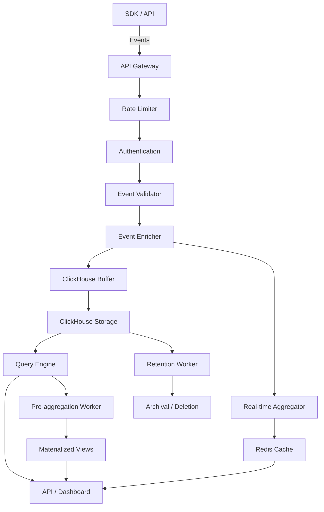

# Product Requirements Document: Universal Analytics Layer

## TL;DR

Build a universal analytics infrastructure that serves as a unified event tracking, querying, and visualization layer for all internal and external use cases. Instead of requiring teams to use multiple tools (PostHog for events, Datadog for infra, Snowflake for warehousing, Stripe for billing), provide one SDK to track any event, one query layer to analyze it, and one dashboard system to visualize it. This makes analytics composable, queryable, and reusable across billing, dashboards, operations, and product metrics.

## 1. Overview

### 1.1 Problem Statement

Modern teams face a fragmented analytics landscape:

- **Multiple Tools**: Teams use Mixpanel/PostHog for user events, Datadog/Grafana for infrastructure, Snowflake/ClickHouse for warehousing, Stripe for usage-based billing, and Metabase for internal dashboards

- **Rebuilding Event Tracking**: Every new use case requires rebuilding event tracking, schemas, and pipelines from scratch

- **Data Silos**: Analytics data is isolated across different tools, making it impossible to correlate events across use cases

- **Complexity Overhead**: Developers must learn multiple analytics tools, each with its own SDK, query language, and API

- **Resource Waste**: Companies waste significant engineering time building internal observability, usage tracking, and custom analytics solutions

### 1.2 Solution

A universal analytics layer that:

- **Unifies Event Tracking**: One flexible event schema that works for billing, product, infrastructure, and custom use cases

- **Provides Universal Query Layer**: Abstract SQL with a simple API that generates optimized ClickHouse queries under the hood

- **Enables Composable Analytics**: Reuse the same metrics across dashboards, billing, alerts, and internal tools

- **Offers Multi-SDK Support**: JavaScript, Python, Go SDKs plus REST/WebSocket APIs for ingestion

- **Delivers Flexible Visualization**: Build custom dashboards, embed widgets, or query metrics directly via API

- **Supports Self-Hosted & Cloud**: Deploy as Docker containers or use cloud-hosted service

### 1.3 Success Metrics

- **SDK Adoption**: 1,000+ SDK integrations within 6 months across all supported languages
- **Event Volume**: 10B+ events ingested per month within 12 months
- **Query Performance**: <500ms average query latency for standard aggregations
- **Developer Experience**: <5 minutes from SDK install to first event tracked
- **Customer Satisfaction**: >4.5/5 rating for developer experience and reliability
- **Revenue Impact**: 40% of customers using the platform for billing or internal analytics within 6 months

## 2. User Stories & Requirements

### 2.1 Core User Stories

**As a developer building a SaaS product, I want to:**

- Track any event (user actions, API calls, feature usage) with a single SDK
- Query metrics without writing SQL or learning a new query language
- Use the same events for billing, product analytics, and internal dashboards
- Embed analytics widgets into my own application
- Deploy the analytics layer myself or use a hosted version

**As a product manager, I want to:**

- View product metrics in real-time dashboards
- Track feature adoption and usage patterns
- Generate reports for stakeholders
- Set up alerts for important metrics
- Share dashboards with team members

**As a finance/ops team member, I want to:**

- Track usage-based billing metrics automatically
- Export billing data for invoicing
- Monitor cost and usage trends
- Set up alerts for unusual usage patterns
- Integrate with billing providers like Stripe

**As a DevOps engineer, I want to:**

- Track infrastructure events and metrics
- Monitor service health and performance
- Correlate infrastructure events with product events
- Set up automated alerts for critical issues
- Build custom observability dashboards

### 2.2 Functional Requirements

#### 2.2.1 Universal Event Model

- **Flexible Schema**: Support arbitrary event properties while maintaining standardized structure
- **Namespace Support**: Organize events by namespace (e.g., `billing`, `product`, `infra`) without siloing data
- **Rich Context**: Include user, organization, timestamp, and custom context in every event
- **Event Versioning**: Support schema evolution without breaking existing queries
- **Type Safety**: Strong typing in SDKs to prevent schema errors

#### 2.2.2 Universal Query & Aggregation Layer

- **Abstracted SQL**: Query builder API that generates optimized ClickHouse queries
- **Pre-aggregated Metrics**: Automatic metric computation and caching
- **Time-Series Support**: Built-in time-series aggregations (hourly, daily, weekly)
- **Filtering & Grouping**: Powerful filtering and grouping capabilities
- **Real-time Queries**: Support for real-time and historical queries
- **API Access**: REST API for programmatic metric access

#### 2.2.3 SDK & Integration Support

- **Multi-Language SDKs**: JavaScript/TypeScript, Python, Go with more languages planned
- **Framework Integrations**: Express, FastAPI, Gin, React, Vue, etc.
- **REST API**: Standard REST endpoints for event ingestion
- **WebSocket API**: Real-time event streaming for high-throughput scenarios
- **Batch Support**: Efficient batch ingestion for bulk data
- **Connector Library**: Pre-built connectors for Kafka, S3, Stripe, etc.

#### 2.2.4 Visualization & Dashboard Layer

- **Custom Dashboards**: Build and customize dashboards with drag-and-drop interface
- **Embed Widgets**: Embed analytics widgets anywhere (iframe or SDK)
- **API Access**: Query metrics directly via API for custom integrations
- **Real-time Updates**: Live dashboard updates as events stream in
- **Export Options**: Export dashboards as PDF, CSV, or images
- **Sharing & Permissions**: Share dashboards with team members and set permissions

#### 2.2.5 Self-Hosted Deployment

- **Docker Compose**: One-command deployment for development and small production
- **Kubernetes Support**: Helm charts for production Kubernetes deployments
- **Configuration Management**: Environment-based configuration
- **Monitoring & Observability**: Built-in health checks and metrics
- **Update Mechanism**: Simple upgrade path for self-hosted instances

### 2.3 Non-Functional Requirements

- **Performance**: <10ms SDK overhead per event, <500ms query latency for standard aggregations
- **Scalability**: Support 1M+ events per second ingestion, billions of rows in storage
- **Reliability**: 99.99% uptime for ingestion and query APIs
- **Security**: End-to-end encryption, secure API key management, role-based access control
- **Compliance**: GDPR, SOC 2, data residency requirements
- **Cost Efficiency**: Low storage and compute costs through ClickHouse optimization

## 3. Technical Architecture

### 3.1 System Components

#### 3.1.1 Universal Event Schema

```typescript
interface UniversalEvent {
  // Required fields
  event: string; // Event name: "user_signup", "api_request", "billing_usage"
  namespace?: string; // Optional namespace: "product", "billing", "infra"
  timestamp: string; // ISO 8601 timestamp
  
  // Core properties
  properties: Record<string, unknown>; // Event-specific properties
  context: {
    // Source context
    source?: "api" | "sdk" | "webhook" | "connector";
    service?: string; // Service name: "user-api", "billing-service"
    version?: string; // Service version
    
    // User context
    user_id?: string;
    org_id?: string;
    session_id?: string;
    
    // Request context
    request_id?: string;
    ip_address?: string;
    user_agent?: string;
    
    // Custom context
    custom?: Record<string, unknown>;
  };
  
  // Metadata
  id?: string; // Event ID (auto-generated if not provided)
  ingested_at?: string; // Ingestion timestamp
}
```

#### 3.1.2 Query Builder API

```typescript
interface MetricQuery {
  metric: string; // Metric name: "active_users", "api_requests", "revenue"
  filter?: {
    namespace?: string;
    event?: string;
    properties?: Record<string, unknown>;
    timeRange?: {
      start: string;
      end: string;
    };
  };
  groupBy?: string[]; // ["day", "user_id", "plan"]
  aggregation?: "count" | "sum" | "avg" | "min" | "max" | "distinct";
  aggregationField?: string; // Field to aggregate
  orderBy?: {
    field: string;
    direction: "asc" | "desc";
  };
  limit?: number;
}

interface MetricResult {
  metric: string;
  value: number | Record<string, number>;
  timestamp?: string;
  metadata?: Record<string, unknown>;
}
```

#### 3.1.3 Data Storage Schema

```sql
-- ClickHouse table for events
CREATE TABLE analytics.events (
  id UUID,
  namespace String,
  event String,
  timestamp DateTime64(3, 'UTC'),
  
  -- Properties (stored as JSON for flexibility)
  properties String, -- JSON encoded
  
  -- Context fields (commonly queried, extracted for performance)
  org_id String,
  user_id Nullable(String),
  service Nullable(String),
  source Nullable(String),
  
  -- Request context
  request_id Nullable(String),
  ip_address Nullable(String),
  user_agent Nullable(String),
  
  -- Custom context (JSON for flexibility)
  context String, -- JSON encoded
  
  -- Metadata
  ingested_at DateTime64(3, 'UTC'),
  
  -- ClickHouse-specific optimizations
  created_at DateTime64(3, 'UTC') DEFAULT now()
) ENGINE = MergeTree()
PARTITION BY toYYYYMM(timestamp)
ORDER BY (namespace, org_id, timestamp, event)
SETTINGS index_granularity = 8192;

-- Materialized views for common aggregations
CREATE MATERIALIZED VIEW analytics.events_hourly_mv
ENGINE = SummingMergeTree()
PARTITION BY toYYYYMM(timestamp)
ORDER BY (namespace, org_id, event, toStartOfHour(timestamp))
AS SELECT
  namespace,
  org_id,
  event,
  toStartOfHour(timestamp) as timestamp,
  count() as event_count
FROM analytics.events
GROUP BY namespace, org_id, event, toStartOfHour(timestamp);

-- Pre-aggregated metrics table
CREATE TABLE analytics.metrics (
  id UUID,
  org_id String,
  metric_name String,
  metric_value Float64,
  dimensions String, -- JSON encoded dimensions
  timestamp DateTime64(3, 'UTC'),
  created_at DateTime64(3, 'UTC') DEFAULT now()
) ENGINE = MergeTree()
PARTITION BY toYYYYMM(timestamp)
ORDER BY (org_id, metric_name, timestamp);
```

#### 3.1.4 PostgreSQL Schema (Configuration & Metadata)

```sql
-- Organizations
CREATE TABLE organizations (
  id UUID PRIMARY KEY DEFAULT gen_random_uuid(),
  name STRING NOT NULL,
  slug STRING UNIQUE NOT NULL,
  created_at TIMESTAMP DEFAULT NOW(),
  updated_at TIMESTAMP DEFAULT NOW()
);

-- API Keys for authentication
CREATE TABLE api_keys (
  id UUID PRIMARY KEY DEFAULT gen_random_uuid(),
  org_id UUID NOT NULL REFERENCES organizations(id),
  name STRING NOT NULL,
  key_hash STRING NOT NULL UNIQUE,
  scopes STRING[] DEFAULT ARRAY['events:write', 'metrics:read'],
  rate_limit_per_minute INT DEFAULT 10000,
  enabled BOOLEAN DEFAULT true,
  created_at TIMESTAMP DEFAULT NOW(),
  expires_at TIMESTAMP
);

-- Metric definitions (computed metrics)
CREATE TABLE metric_definitions (
  id UUID PRIMARY KEY DEFAULT gen_random_uuid(),
  org_id UUID NOT NULL REFERENCES organizations(id),
  name STRING NOT NULL,
  description TEXT,
  query_config JSONB NOT NULL, -- MetricQuery configuration
  enabled BOOLEAN DEFAULT true,
  created_at TIMESTAMP DEFAULT NOW(),
  updated_at TIMESTAMP DEFAULT NOW(),
  UNIQUE(org_id, name)
);

-- Dashboard configurations
CREATE TABLE dashboards (
  id UUID PRIMARY KEY DEFAULT gen_random_uuid(),
  org_id UUID NOT NULL REFERENCES organizations(id),
  name STRING NOT NULL,
  description TEXT,
  layout JSONB NOT NULL, -- Dashboard layout configuration
  public BOOLEAN DEFAULT false,
  public_token STRING UNIQUE, -- For public dashboards
  created_at TIMESTAMP DEFAULT NOW(),
  updated_at TIMESTAMP DEFAULT NOW()
);

-- Namespace configurations
CREATE TABLE namespaces (
  id UUID PRIMARY KEY DEFAULT gen_random_uuid(),
  org_id UUID NOT NULL REFERENCES organizations(id),
  name STRING NOT NULL,
  description TEXT,
  schema JSONB, -- Optional JSON schema for events in this namespace
  retention_days INT DEFAULT 90,
  created_at TIMESTAMP DEFAULT NOW(),
  updated_at TIMESTAMP DEFAULT NOW(),
  UNIQUE(org_id, name)
);
```

### 3.2 System Architecture

#### 3.2.1 Data Flow



#### 3.2.2 Component Architecture

```typescript
interface UniversalAnalyticsSystem {
  // Ingestion layer
  ingestion: {
    apiGateway: APIGateway;
    rateLimiter: RateLimiter;
    authenticator: Authenticator;
    validator: EventValidator;
    enricher: EventEnricher;
    buffer: ClickHouseBuffer;
  };
  
  // Storage layer
  storage: {
    clickhouse: ClickHouseClient;
    postgres: PostgreSQLClient;
    redis: RedisClient;
  };
  
  // Query layer
  query: {
    queryBuilder: QueryBuilder;
    queryExecutor: QueryExecutor;
    metricComputer: MetricComputer;
    cache: QueryCache;
  };
  
  // Aggregation layer
  aggregation: {
    realTimeAggregator: RealTimeAggregator;
    batchAggregator: BatchAggregator;
    materializedViewManager: MaterializedViewManager;
  };
  
  // Visualization layer
  visualization: {
    dashboardEngine: DashboardEngine;
    widgetRenderer: WidgetRenderer;
    exportService: ExportService;
  };
}
```

### 3.3 SDK Architecture

#### 3.3.1 Core SDK Interface

```typescript
interface UniversalAnalyticsSDK {
  // Initialization
  init(config: SDKConfig): void;
  
  // Event tracking
  track(event: string, properties?: Record<string, unknown>): void;
  track(namespace: string, event: string, properties?: Record<string, unknown>): void;
  
  // Context management
  setContext(context: Partial<EventContext>): void;
  setUser(userId: string, properties?: Record<string, unknown>): void;
  setOrganization(orgId: string): void;
  
  // Batch operations
  flush(): Promise<void>;
  
  // Configuration
  setSamplingRate(rate: number): void; // 0.0 to 1.0
  enable(): void;
  disable(): void;
}

interface SDKConfig {
  apiKey: string;
  orgId?: string;
  endpoint?: string; // Default: https://api.databuddy.com
  batchSize?: number; // Default: 100
  flushInterval?: number; // Default: 5000ms
  samplingRate?: number; // Default: 1.0
  enableCompression?: boolean; // Default: true
  customContext?: Record<string, unknown>;
}
```

#### 3.3.2 Language-Specific Implementations

**JavaScript/TypeScript SDK:**

```typescript
import { UniversalAnalytics } from '@databuddy/analytics';

const analytics = new UniversalAnalytics({
  apiKey: process.env.DATABUDDY_API_KEY,
  orgId: process.env.DATABUDDY_ORG_ID,
});

// Simple event tracking
analytics.track('user_signup', {
  plan: 'pro',
  source: 'website',
});

// Namespaced event tracking
analytics.track('billing', 'usage_recorded', {
  feature: 'api_calls',
  quantity: 1000,
  amount: 50.00,
});

// Set user context
analytics.setUser('user_123', {
  email: 'user@example.com',
  plan: 'pro',
});

// Set organization context
analytics.setOrganization('org_456');

// Track with custom context
analytics.setContext({
  service: 'user-api',
  version: '1.2.0',
});

analytics.track('api_request', {
  endpoint: '/api/users',
  method: 'GET',
  status_code: 200,
  response_time_ms: 150,
});
```

**Python SDK:**

```python
from databuddy import UniversalAnalytics

analytics = UniversalAnalytics(
    api_key=os.getenv("DATABUDDY_API_KEY"),
    org_id=os.getenv("DATABUDDY_ORG_ID"),
)

# Simple event tracking
analytics.track("user_signup", {
    "plan": "pro",
    "source": "website",
})

# Namespaced event tracking
analytics.track("billing", "usage_recorded", {
    "feature": "api_calls",
    "quantity": 1000,
    "amount": 50.00,
})

# Set context
analytics.set_user("user_123", {
    "email": "user@example.com",
    "plan": "pro",
})

analytics.set_organization("org_456")
```

**Go SDK:**

```go
package main

import (
    "github.com/databuddy/analytics-go"
)

func main() {
    analytics := databuddy.New(databuddy.Config{
        APIKey: os.Getenv("DATABUDDY_API_KEY"),
        OrgID:  os.Getenv("DATABUDDY_ORG_ID"),
    })
    
    // Simple event tracking
    analytics.Track("user_signup", map[string]interface{}{
        "plan":   "pro",
        "source": "website",
    })
    
    // Namespaced event tracking
    analytics.TrackNamespace("billing", "usage_recorded", map[string]interface{}{
        "feature":  "api_calls",
        "quantity": 1000,
        "amount":   50.00,
    })
    
    // Set context
    analytics.SetUser("user_123", map[string]interface{}{
        "email": "user@example.com",
        "plan":  "pro",
    })
    
    analytics.SetOrganization("org_456")
}
```

### 3.4 Integration Points

#### 3.4.1 Framework Integrations

**Express.js Middleware:**

```typescript
import express from 'express';
import { UniversalAnalytics } from '@databuddy/analytics';

const analytics = new UniversalAnalytics({
  apiKey: process.env.DATABUDDY_API_KEY,
});

const app = express();

// Auto-track API requests
app.use(analytics.middleware());

app.post('/api/users', async (req, res) => {
  const user = await createUser(req.body);
  
  // Custom event tracking
  analytics.track('user_created', {
    user_id: user.id,
    plan: user.plan,
  });
  
  res.json(user);
});
```

**FastAPI Middleware:**

```python
from fastapi import FastAPI
from databuddy.middleware import AnalyticsMiddleware

app = FastAPI()

analytics = UniversalAnalytics(
    api_key=os.getenv("DATABUDDY_API_KEY"),
)

app.add_middleware(AnalyticsMiddleware, analytics=analytics)

@app.post("/api/users")
async def create_user(user_data: UserCreate):
    user = await create_user_service(user_data)
    
    analytics.track("user_created", {
        "user_id": user.id,
        "plan": user.plan,
    })
    
    return user
```

#### 3.4.2 Connector Library

**Stripe Connector:**

```typescript
import { StripeConnector } from '@databuddy/connectors/stripe';

const stripeConnector = new StripeConnector({
  stripeKey: process.env.STRIPE_SECRET_KEY,
  analytics: analytics,
  webhookSecret: process.env.STRIPE_WEBHOOK_SECRET,
});

// Automatically tracks Stripe events as analytics events
stripeConnector.start();
```

**Kafka Connector:**

```typescript
import { KafkaConnector } from '@databuddy/connectors/kafka';

const kafkaConnector = new KafkaConnector({
  brokers: ['localhost:9092'],
  topics: ['user-events', 'api-events'],
  analytics: analytics,
});

// Streams Kafka messages as analytics events
kafkaConnector.start();
```

## 4. User Interface Design

### 4.1 Event Explorer

- **Event Browser**: Browse events by namespace, event type, and time range
- **Event Details**: View full event payload with formatted JSON
- **Event Search**: Search events by properties, context, or event name
- **Event Stream**: Real-time event stream with filtering
- **Schema Inspector**: View inferred schemas for events and properties

### 4.2 Query Builder Interface

- **Visual Query Builder**: Drag-and-drop interface for building metric queries
- **Query Editor**: SQL-like query editor with autocomplete
- **Query History**: Save and reuse common queries
- **Query Performance**: Show query execution time and optimization hints
- **Query Results**: Interactive results table with export options

### 4.3 Dashboard Builder

- **Widget Library**: Pre-built widgets (line charts, bar charts, tables, metrics)
- **Drag-and-Drop Layout**: Arrange widgets in custom layouts
- **Real-time Updates**: Live dashboard updates as events stream in
- **Dashboard Templates**: Pre-built dashboard templates for common use cases
- **Sharing & Embedding**: Share dashboards with team or embed in applications
- **Mobile Responsive**: Dashboards automatically adapt to mobile screens

### 4.4 Metric Management

- **Metric Definitions**: Define computed metrics with query builder
- **Metric Library**: Browse and reuse metrics across dashboards
- **Metric Performance**: View metric computation time and cache hit rates
- **Metric Dependencies**: Visualize metric dependencies and relationships
- **Metric Alerts**: Set up alerts based on metric thresholds

### 4.5 Namespace Management

- **Namespace Overview**: View all namespaces and their event counts
- **Schema Management**: Define and enforce schemas for namespaces
- **Retention Policies**: Configure data retention per namespace
- **Access Control**: Set permissions per namespace

## 5. Implementation Plan

### Phase 1: Core Infrastructure (8 weeks)

**Weeks 1-2: Foundation**
- [ ] Database schema design and migration (ClickHouse + PostgreSQL)
- [ ] API Gateway setup with authentication and rate limiting
- [ ] Basic event ingestion endpoint
- [ ] ClickHouse storage and querying setup
- [ ] PostgreSQL schema for configuration

**Weeks 3-4: Core SDK**
- [ ] JavaScript/TypeScript SDK development
- [ ] Event validation and enrichment logic
- [ ] Batch ingestion and buffering
- [ ] SDK documentation and examples

**Weeks 5-6: Query Layer**
- [ ] Query builder API implementation
- [ ] ClickHouse query generation
- [ ] Basic metric computation
- [ ] Query API endpoints

**Weeks 7-8: Basic Dashboard**
- [ ] Dashboard API and storage
- [ ] Basic widget rendering
- [ ] Simple dashboard UI
- [ ] Event explorer interface

### Phase 2: Advanced Features (6 weeks)

**Weeks 9-10: Aggregation & Performance**
- [ ] Materialized views for common aggregations
- [ ] Pre-aggregation worker
- [ ] Query caching layer
- [ ] Performance optimization

**Weeks 11-12: Multi-language SDKs**
- [ ] Python SDK development
- [ ] Go SDK development
- [ ] Framework integrations (Express, FastAPI, Gin)
- [ ] SDK documentation

**Weeks 13-14: Advanced Dashboard**
- [ ] Drag-and-drop dashboard builder
- [ ] Widget library expansion
- [ ] Real-time dashboard updates
- [ ] Dashboard sharing and embedding

### Phase 3: Self-Hosted & Connectors (5 weeks)

**Weeks 15-16: Self-Hosted Deployment**
- [ ] Docker Compose setup
- [ ] Kubernetes Helm charts
- [ ] Configuration management
- [ ] Deployment documentation

**Weeks 17-18: Connector Library**
- [ ] Stripe connector
- [ ] Kafka connector
- [ ] S3 connector
- [ ] Webhook connector framework

**Week 19: Testing & Documentation**
- [ ] Comprehensive testing
- [ ] API documentation
- [ ] Deployment guides
- [ ] Tutorials and examples

### Phase 4: Enterprise Features (4 weeks)

**Weeks 20-21: Advanced Features**
- [ ] Metric definitions system
- [ ] Alert system
- [ ] Advanced access control
- [ ] Audit logging

**Weeks 22-23: Integrations & Export**
- [ ] Webhook integrations
- [ ] API for programmatic access
- [ ] Data export (CSV, JSON, Parquet)
- [ ] Third-party integrations (Slack, PagerDuty)

### Phase 5: Scale & Polish (3 weeks)

**Week 24: Performance Optimization**
- [ ] Load testing
- [ ] Query optimization
- [ ] Caching improvements
- [ ] Infrastructure scaling

**Week 25: Developer Experience**
- [ ] SDK improvements based on feedback
- [ ] Documentation improvements
- [ ] Example applications
- [ ] Developer onboarding flow

**Week 26: Launch Preparation**
- [ ] Security audit
- [ ] Compliance review
- [ ] Marketing materials
- [ ] Launch plan

## 6. API Specifications

### 6.1 Event Ingestion

```typescript
// Ingest single event
POST /api/v1/events
Authorization: Bearer {api_key}
Content-Type: application/json

{
  event: "user_signup",
  namespace?: "product",
  properties: {
    plan: "pro",
    source: "website",
  },
  context?: {
    user_id: "user_123",
    service: "user-api",
  },
  timestamp?: "2025-01-31T12:00:00Z"
}

// Ingest batch events
POST /api/v1/events/batch
Authorization: Bearer {api_key}
Content-Type: application/json

{
  events: [
    { event: "user_signup", properties: {...} },
    { event: "api_request", properties: {...} },
  ]
}

// Stream events (WebSocket)
WS /api/v1/events/stream
Authorization: Bearer {api_key}

// Send events as messages
{
  event: "user_signup",
  properties: {...}
}
```

### 6.2 Query API

```typescript
// Query metrics
POST /api/v1/metrics/query
Authorization: Bearer {api_key}
Content-Type: application/json

{
  metric: "active_users",
  filter: {
    namespace: "product",
    timeRange: {
      start: "2025-01-01T00:00:00Z",
      end: "2025-01-31T23:59:59Z",
    },
    properties: {
      plan: "pro",
    },
  },
  groupBy: ["day"],
  aggregation: "count",
  aggregationField: "user_id",
}

Response:
{
  metric: "active_users",
  value: {
    "2025-01-01": 1250,
    "2025-01-02": 1320,
    ...
  },
  metadata: {
    queryTime: "245ms",
    cached: false,
  },
}

// Get pre-defined metric
GET /api/v1/metrics/{metricName}
Authorization: Bearer {api_key}
Query Parameters:
  - start: ISO 8601 timestamp
  - end: ISO 8601 timestamp
  - groupBy: comma-separated dimensions
  - filter: JSON string

// List available metrics
GET /api/v1/metrics
Authorization: Bearer {api_key}
```

### 6.3 Dashboard API

```typescript
// Create dashboard
POST /api/v1/dashboards
Authorization: Bearer {api_key}
Content-Type: application/json

{
  name: "Product Analytics",
  description: "Key product metrics",
  layout: {
    widgets: [
      {
        type: "metric",
        metric: "active_users",
        position: { x: 0, y: 0, w: 4, h: 2 },
      },
      {
        type: "chart",
        metric: "signups",
        chartType: "line",
        position: { x: 4, y: 0, w: 8, h: 4 },
      },
    ],
  },
}

// Get dashboard
GET /api/v1/dashboards/{id}

// Update dashboard
PUT /api/v1/dashboards/{id}

// Delete dashboard
DELETE /api/v1/dashboards/{id}

// Get public dashboard (no auth required)
GET /api/v1/public/dashboards/{publicToken}
```

### 6.4 Event Query API

```typescript
// Query events
POST /api/v1/events/query
Authorization: Bearer {api_key}
Content-Type: application/json

{
  filter: {
    namespace: "product",
    event: "user_signup",
    timeRange: {
      start: "2025-01-01T00:00:00Z",
      end: "2025-01-31T23:59:59Z",
    },
    properties: {
      plan: "pro",
    },
  },
  limit: 100,
  offset: 0,
  orderBy: {
    field: "timestamp",
    direction: "desc",
  },
}

Response:
{
  events: [
    {
      id: "event_123",
      event: "user_signup",
      properties: {...},
      context: {...},
      timestamp: "2025-01-15T10:30:00Z",
    },
    ...
  ],
  total: 1250,
  limit: 100,
  offset: 0,
}
```

## 7. Security Considerations

### 7.1 Data Protection

- **API Key Security**: Secure generation, hashing, and storage of API keys
- **Encryption**: End-to-end encryption for event data in transit and at rest
- **Access Control**: Role-based access control (RBAC) for organizations and dashboards
- **Data Isolation**: Strict data isolation between organizations
- **Audit Logging**: Comprehensive audit logs for all data access and modifications

### 7.2 Privacy Compliance

- **GDPR Compliance**: 
  - Right to access: Users can export their data
  - Right to deletion: Users can delete their events and data
  - Data processing consent: Clear consent mechanisms
  - Data portability: Export data in standard formats
  
- **Data Residency**: Support for geographic data storage (EU, US, etc.)
- **PII Handling**: Tools to identify and mask PII in events
- **Retention Policies**: Configurable data retention with automatic deletion

### 7.3 Security Best Practices

- **Rate Limiting**: Per-API-key rate limiting to prevent abuse
- **Input Validation**: Strict validation of all event data
- **SQL Injection Prevention**: Parameterized queries and query builder validation
- **DDoS Protection**: Distributed rate limiting and request throttling
- **Security Headers**: Proper security headers on all API responses

## 8. Pricing & Business Model

### 8.1 Pricing Tiers

**Free Tier:**
- 100K events/month
- 7-day data retention
- Basic dashboards
- Community support
- Self-hosted option available

**Pro Tier ($99/month):**
- 1M events/month
- 30-day data retention
- Advanced dashboards
- Custom metrics
- Email support
- Priority query performance

**Business Tier ($499/month):**
- 10M events/month
- 90-day data retention
- Unlimited dashboards
- Advanced analytics
- Alert system
- Phone support
- SLA guarantee

**Enterprise Tier (Custom):**
- Unlimited events
- Custom data retention
- Dedicated infrastructure
- White-label options
- Custom integrations
- 24/7 support
- On-premise deployment option

### 8.2 Usage Metrics

- **Event Volume**: Number of events ingested per month
- **Data Retention**: Length of data retention period
- **Query Volume**: Number of queries executed per month
- **Dashboard Count**: Number of dashboards created
- **Team Members**: Number of users per organization
- **Custom Metrics**: Number of custom metric definitions
- **API Rate Limits**: Higher limits for higher tiers

### 8.3 Self-Hosted Licensing

- **Community Edition**: Open-source, self-hosted, unlimited events
- **Enterprise Edition**: Commercial license with support and advanced features
- **Hybrid Option**: Cloud-hosted with on-premise event storage option

## 9. Success Metrics & KPIs

### 9.1 Technical Metrics

- **SDK Performance**: <10ms average overhead per event tracked
- **Ingestion Reliability**: >99.99% successful event ingestion rate
- **Query Performance**: <500ms average query latency for standard aggregations
- **System Uptime**: >99.99% availability for ingestion and query APIs
- **Data Accuracy**: >99.9% accurate event tracking and aggregation

### 9.2 Adoption Metrics

- **SDK Downloads**: Track downloads across all language SDKs
- **Active Integrations**: Number of organizations actively tracking events
- **Event Volume**: Total events ingested per month (target: 10B+ within 12 months)
- **Dashboard Usage**: Number of active dashboards and dashboard views
- **API Usage**: API calls per month for programmatic access

### 9.3 Business Metrics

- **Customer Acquisition**: New customers per month
- **Revenue Growth**: Monthly recurring revenue (MRR) growth
- **Customer Retention**: Monthly and annual retention rates
- **Feature Adoption**: % of customers using key features (dashboards, metrics, alerts)
- **Customer Satisfaction**: NPS score and customer satisfaction ratings
- **Support Efficiency**: Average time to resolution for support tickets

### 9.4 Developer Experience Metrics

- **Time to First Event**: Average time from SDK install to first event tracked (target: <5 minutes)
- **Documentation Engagement**: Documentation page views and time spent
- **SDK Error Rate**: Rate of SDK-related errors and issues
- **Community Engagement**: GitHub stars, contributions, and community activity

## 10. Risk Assessment & Mitigation

### 10.1 Technical Risks

**Risk: Query Performance Degradation**
- **Mitigation**: Implement materialized views, query caching, and query optimization
- **Monitoring**: Track query performance metrics and set up alerts

**Risk: Data Loss**
- **Mitigation**: Implement redundant storage, backups, and event acknowledgments
- **Monitoring**: Monitor ingestion success rates and storage health

**Risk: Scalability Issues**
- **Mitigation**: Design for horizontal scaling from day one, use ClickHouse for scalability
- **Monitoring**: Track ingestion rates and storage growth

**Risk: SDK Reliability**
- **Mitigation**: Graceful failure handling, offline queuing, retry logic
- **Monitoring**: Track SDK error rates and crash reports

### 10.2 Business Risks

**Risk: Low Adoption**
- **Mitigation**: Focus on developer experience, comprehensive documentation, and example applications
- **Strategy**: Clear value proposition and comparison with existing tools

**Risk: Competitive Pressure**
- **Mitigation**: Focus on universality and developer experience as differentiators
- **Strategy**: Build strong community and open-source components

**Risk: Complexity Overhead**
- **Mitigation**: Keep the product simple, focus on core use cases first
- **Strategy**: Phased feature rollout based on user feedback

**Risk: Support Overhead**
- **Mitigation**: Comprehensive self-service documentation, tutorials, and community support
- **Strategy**: Build excellent developer experience to reduce support needs

### 10.3 Compliance Risks

**Risk: GDPR Violations**
- **Mitigation**: Implement data deletion, export, and consent management features
- **Monitoring**: Regular compliance audits and privacy impact assessments

**Risk: Data Breaches**
- **Mitigation**: Strong encryption, access controls, and security best practices
- **Monitoring**: Security monitoring and incident response procedures

## 11. Future Enhancements

### 11.1 Advanced Analytics

- **Machine Learning**: Anomaly detection, predictive analytics, and automated insights
- **Cohort Analysis**: Advanced user behavior analysis and cohort tracking
- **Funnel Analysis**: Conversion funnel tracking and optimization
- **Retention Analysis**: User retention and churn analysis

### 11.2 Integration Expansions

- **More SDKs**: Rust, Ruby, PHP, Java SDKs
- **More Connectors**: Segment, Mixpanel, Amplitude, Google Analytics connectors
- **Business Intelligence**: Integration with Tableau, Power BI, Looker
- **Data Warehouses**: Integration with Snowflake, BigQuery, Redshift

### 11.3 Enterprise Features

- **Multi-tenant Architecture**: Enhanced multi-tenancy with data isolation
- **Advanced RBAC**: Fine-grained permissions and role management
- **Custom Branding**: White-label dashboards and email reports
- **Dedicated Infrastructure**: Dedicated clusters for enterprise customers
- **On-premise Deployment**: Full on-premise deployment option

### 11.4 Developer Experience

- **CLI Tool**: Command-line interface for managing analytics
- **Visual Studio Code Extension**: Analytics management from VS Code
- **GraphQL API**: GraphQL API for flexible querying
- **Event Replay**: Replay events for testing and debugging
- **Schema Registry**: Centralized schema management and validation

### 11.5 Observability Features

- **Service Map**: Visualize service dependencies and event flows
- **Distributed Tracing**: Trace events across services
- **Performance Monitoring**: Track SDK and API performance
- **Health Dashboards**: System health and performance dashboards

---

**Document Version**: 1.0  
**Last Updated**: January 2025  
**Next Review**: February 2025  
**Owner**: Product Team  
**Stakeholders**: Engineering, Design, Developer Relations, Customer Success, Sales
